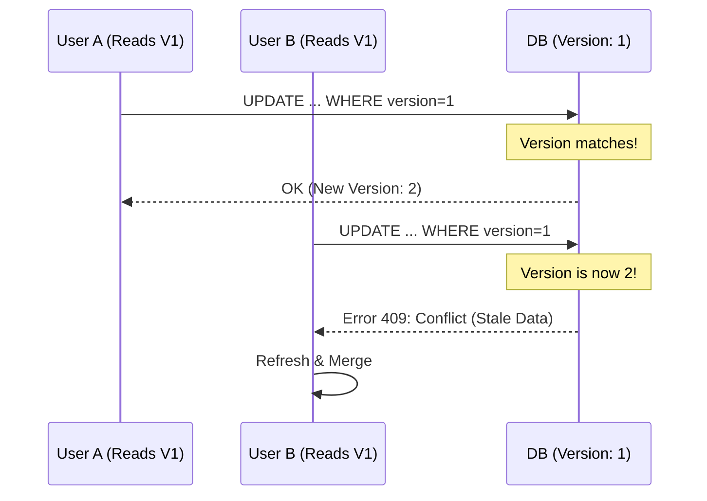

# StudySync: Resilient Distributed Systems Analysis & Design

**Student Name:** Usama  
**Student ID:** BSCS23164  
**Course:** Parallel and Distributed Computing (PDC)

---

## Part 1: Analyzing the Mess — Root Cause Analysis

The current StudySync architecture suffers from "Naive Distribution." It was built under the assumption of a reliable network and instantaneous, serial execution. When scaled to 1,000 users, these fallacies of distributed computing led to three distinct categories of failure.

### Problem 1: Synchronization (The Lost Update Anomaly)
The silent loss of data when two users edit the same document is a classic **Race Condition** caused by a lack of concurrency control in the database transaction lifecycle. 
- **Root Cause**: The system follows a "Blind Update" pattern. The application reads the document state into memory, modifies it, and then persists the entire object back to the database. 
- **The Failure**: Because there is no check to see if the record has changed since it was read (Optimistic) or any lock held during the process (Pessimistic), the second user's "Write" operation effectively deletes the first user's "Write." 
- **Technical Gap**: The database's default **Read Committed** isolation level is insufficient here; it ensures we don't read partial data, but it does nothing to prevent two valid, committed transactions from conflicting at the application logic level.

### Problem 2: Coordination (Dropped Clerk Webhooks)
The "Zombie Premium" status issue is a failure of **Distributed Coordination**. 
- **Root Cause**: The system relies on **Tight Temporal Coupling**. It assumes that the StudySync backend will be available and responsive at the exact millisecond Clerk sends an HTTP notification. 
- **The Failure**: If the network blips or the server is under high load, the webhook—a "fire-and-forget" event—is lost forever. 
- **Technical Gap**: There is no **Durability Layer**. In a resilient system, the receipt of a message should be decoupled from its processing. Currently, the failure of the transport layer results in a permanent state inconsistency because there is no retry mechanism, no idempotency checking (to handle duplicates), and no persistent event log to recover from crashes.

### Problem 3: Fault Tolerance (Cascading Failure & Resource Exhaustion)
The total system hang during AI generation is a **Cascading Failure** triggered by an external dependency.
- **Root Cause**: **Synchronous Blocking I/O**. When the FastAPI server calls the external LLM API, it ties up a worker thread. 
- **The Failure**: If the LLM provider experiences latency (e.g., a 60-second timeout), that thread is held hostage. Under load, all available threads in the server's pool become occupied waiting for the LLM. 
- **Technical Gap**: The LLM has become a **Single Point of Failure (SPOF)**. Without a **Circuit Breaker** to "fail-fast" or an **Asynchronous** execution model to free up threads, a localized delay in an optional AI feature escalates into a total denial of service for every user of the platform.

---

## Part 2: Designing a Better System — Architectural Solutions

### Solution 1: Optimistic Concurrency Control (OCC)
To resolve the Lost Update, we will implement **Versioning**. Every document will carry a `version_id` (a monotonically increasing integer).
- **Mechanism**: When a client fetches a document, they receive its current version (e.g., v10). When they submit an update, the SQL command will be: `UPDATE documents SET content = ?, version = 11 WHERE id = ? AND version = 10`.
- **Outcome**: If another user updated the document to v11 in the interim, the `WHERE` clause will fail. The application will then catch this "zero rows affected" result and return a `409 Conflict`, prompting the user to merge their changes rather than overwriting others.

#### UML Sequence Diagram: Concurrency Conflict Resolution

### Solution 2: Durable Webhook Processing
To ensure we never drop a subscription cancellation, we must move from "Synchronous Processing" to "Asynchronous Event Sourcing."
- **Persistence First**: Upon receiving a webhook, the API should immediately write the raw JSON to a `webhook_inbox` table with a status of `PENDING`. This takes milliseconds and is highly reliable.
- **Idempotency**: We will use the Clerk `event_id` as a unique constraint. If we receive the same event twice, the database will reject the duplicate, preventing corrupted state.
- **Reliable Delivery**: A background worker (like Celery or a simple cron) will process the `PENDING` items. If it fails, it retries with exponential backoff. Persistent failures are moved to a **Dead-Letter Queue (DLQ)** for manual auditing.

### Solution 3: Resilience via Circuit Breakers
To protect the server from LLM outages, we implement the **Circuit Breaker Pattern** (specifically the Martin Fowler model).
- **CLOSED State**: Requests flow to the LLM. We track failure rates and timeouts.
- **OPEN State**: If 5 consecutive requests fail or take >10s, the circuit "trips." For the next 30 seconds, all calls to `/generate-summary` fail **instantly** without touching the network. We return a "Fallback Response" (e.g., "AI Summary is temporarily offline").
- **HALF-OPEN State**: After the cooldown, one request is allowed through to test the LLM's health. If successful, the circuit closes.
- **Non-Blocking I/O**: We will migrate to `httpx` (Async) to ensure that even during the 10-second timeout window, the FastAPI event loop remains free to serve other users.

---

## CAP Theorem Analysis & Trade-offs
In a partitioned network (P), we must choose between Consistency (C) and Availability (A).

1. **Document Editing (CP)**: We choose **Consistency**. It is better to deny an update (lower Availability) than to allow two users to diverge and lose data. We force users to synchronize with the latest state.
2. **Subscription Management (AP)**: We choose **Availability & Eventual Consistency**. We accept the webhook immediately (high Availability) but acknowledge that the database update might happen a few seconds later. This "lag" is acceptable for billing.
3. **AI Generation (AP)**: We choose **Availability**. By using a Circuit Breaker fallback, the system remains "Available" even if the AI's "Consistency" (providing a real summary) is temporarily degraded.
